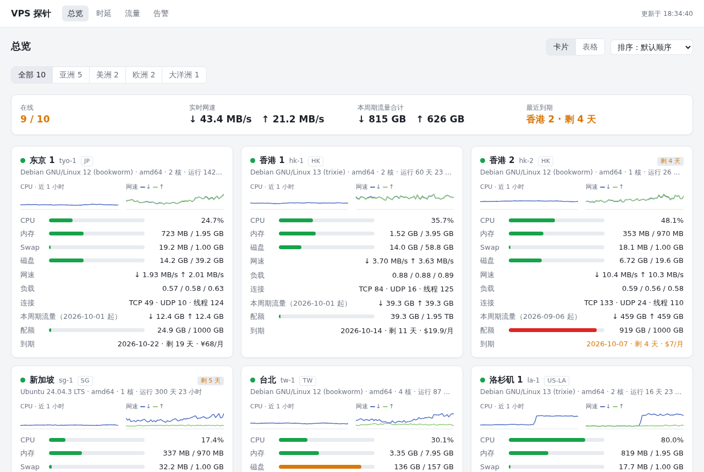
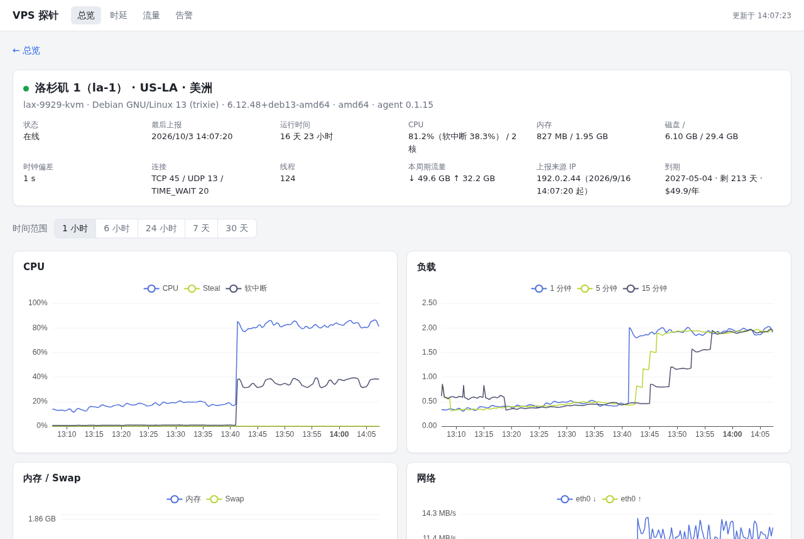
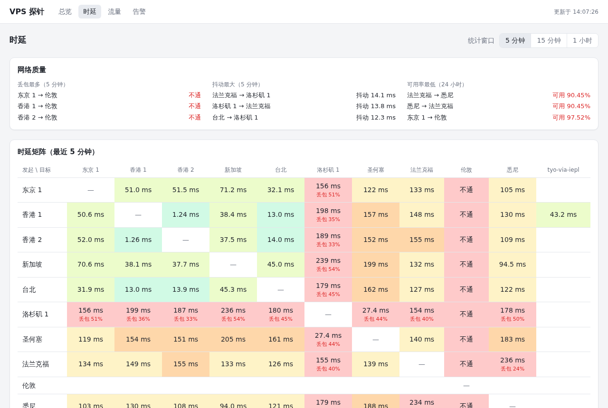
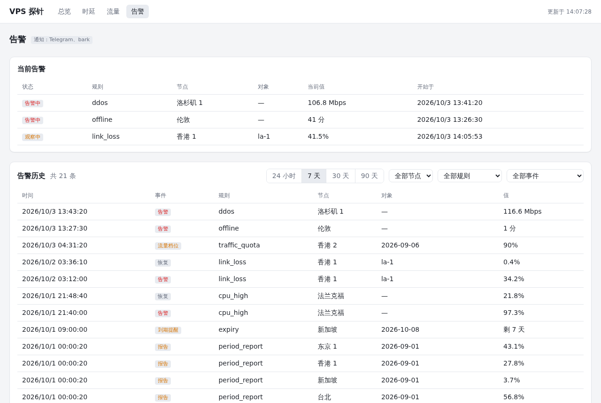

# vps-probe

给自己的一小群 VPS 用的探针：资源监控、节点间时延矩阵、按计费周期统计的流量（重启不丢）、DDoS 识别、到期提醒，Telegram / webhook 告警。

设计上只有一条硬规矩：**agent 只推不收，不接受服务端的任何指令。** 服务端被攻破，攻击者也没法在你的 VPS 上执行任何东西。

**在线演示**：<https://vps-probe-demo.shakespark.workers.dev>（界面是真的，节点和数据都是虚构的，在浏览器里生成，没有后端）。

| 总览 | 节点详情 |
|---|---|
|  |  |
| **时延矩阵与链路可用性** | **告警** |
|  |  |

## 功能

- **资源**：CPU（含 steal、软中断）、负载、内存 / Swap、磁盘、各网卡网速和包速率、TCP / UDP 连接数；10 秒一个点，保留 48 小时原始数据、30 天 5 分钟聚合、400 天 1 小时聚合。
- **流量**：按每台机器自己的计费周期（重置日、重置时刻）累计，agent 重启、VPS 重启、计数器归零都不丢；配额进度、每日用量、周期结算和每周汇总。
- **时延**：节点两两互 ping 的矩阵、每条链路的历史曲线（按丢包着色）和 24 小时 / 7 天 / 30 天可用率；还能测经隧道（端口转发、VPN）的时延。
- **告警**：离线、CPU / 内存 / 磁盘、链路丢包、流量配额档位、到期提醒、上报 IP 变化；**DDoS 识别**（入站远大于出站，附包速率和其他节点到它的丢包作为证据）和被利用对外攻击的识别。Telegram 和任意 webhook（Bark、ntfy、Discord、Server 酱……）。
- **部署**：服务端一个程序加一个 SQLite 文件，迁移只要两个文件；agent 一个 5 MB 的静态程序，普通用户运行。一条命令加节点，一条命令在 VPS 上装好 agent。
- 深色 / 浅色自适应，手机可用；页面的地址带着时间范围和筛选条件，可以收藏和分享。
- 只支持 Linux + systemd（amd64 / arm64）。在 KVM 的 VPS 上长期运行过；支持 LXC 容器（在 Proxmox 的 LXC 上实测过）；OpenVZ 只有网卡识别的兜底，还没有在真机上验证。

## 安全模型

写这个探针的起因，是别的探针出过"面板被攻破 → 所有被监控的机器被批量执行命令"的事故。所以这里把"面板能控制机器"这件事从设计上去掉了：

| 如果这个被攻破 | 攻击者能做的 | 做不到的 |
|---|---|---|
| **服务端** | 看到、篡改监控数据；用你的通知渠道发消息 | 在任何 VPS 上执行命令、下发配置、推送更新：agent 没有接收这些东西的代码 |
| **某一台 VPS** | 伪造这一台自己的监控数据（每台的 token 各不相同） | 冒充别的节点；借主机名之类的字符串在网页里执行脚本 |
| **GitHub 账号或 CI** | 往仓库推代码、替换 Release 里的文件 | 发出能通过验证的发布包：签名密钥离线保存，CI 不持有；构建可复现，任何人都能核对 |
| 没登录的访客 | 无 | 网页必须先登录（Cloudflare Access 或 Basic 认证），没有匿名可见的页面 |

具体做法：

- agent 以普通用户运行，**不监听任何端口**，只向服务端发加密的 UDP 报文；唯一收的是"已收到"的确认。
- agent 不执行命令、不下载脚本、不自动更新、不从服务端拉配置；ping 谁也写在它自己的配置文件里。
- 网页**只读**，只有 GET 接口；所有配置都在服务端的配置文件里，改配置要登录服务器。
- 通知渠道只发不收，没有"给 bot 发消息来控制探针"这回事。
- 服务端唯一对公网开放的是一个 UDP 端口，校验不过的包一律不回应，端口扫描看起来和关着一样。

完整的设计和取舍见 [docs/DESIGN.md](docs/DESIGN.md)。

## 和常见探针的区别

以"带远程管理功能的探针"（哪吒这一类）的默认配置为参照：

| | vps-probe | 带远程管理的探针 |
|---|---|---|
| 面板向 agent 下发命令 / 网页终端 / 计划任务 | 没有，设计上排除 | 有 |
| agent 权限 | 普通用户，不监听端口 | 通常是 root |
| agent 自动更新 | 没有，升级由你在 VPS 上执行 | 通常默认开启 |
| 配置入口 | 配置文件和命令行 | 网页后台 |
| 网页 | 只读，必须登录 | 可公开展示，可在网页上管理 |
| 发布包 | 离线密钥签名，可复现构建 | 各项目不同 |

相应地，**这些它不做**，需要的话请用别的探针：

- 网页上加节点、改配置；网页终端、远程执行命令、文件管理。
- 公开的状态页（给别人看的那种）。
- Windows / macOS / 非 systemd 系统的 agent。
- 对网站或端口的可用性监控（HTTP / TCP 探测）；它只测节点之间的时延。
- 多用户和权限。

## 快速开始

需要：一台有公网 IP 的 Linux VPS 做服务端，被监控的机器能向它发 UDP。下面的命令都以 root 执行；每一步的细节和其他做法见 [docs/install.md](docs/install.md)。

**1. 在服务端下载发布包并验证签名**

```sh
V=0.4.1
B=https://github.com/shakespark/vps-probe/releases/download/v$V
curl -fLO $B/vps-probe-$V-linux-amd64.tar.gz -fLO $B/vps-probe-$V.sha256 -fLO $B/vps-probe-$V.sha256.sig

echo 'shakespark namespaces="vps-probe-release" ssh-ed25519 AAAAC3NzaC1lZDI1NTE5AAAAINDQDD9r2Mz+c1/6CsxfhDCaC36NKng8VLjgct61j567' > release-signers
ssh-keygen -Y verify -f release-signers -I shakespark -n vps-probe-release \
    -s vps-probe-$V.sha256.sig < vps-probe-$V.sha256    # 应输出 Good "vps-probe-release" signature
sha256sum -c --ignore-missing vps-probe-$V.sha256      # 应输出 OK
```

ARM 的机器把 `amd64` 换成 `arm64`。发布公钥的指纹是 `SHA256:58Ji7UsUqJ+HoARS8RJsg88YH+M1bhivbOcJSXY/0Dg`。

**2. 安装服务端**

```sh
tar xzf vps-probe-$V-linux-amd64.tar.gz && cd vps-probe-$V-linux-amd64
./install.sh server                    # 用示例配置启动：还没有节点
vi /etc/vps-probe/server.yml           # 填 public_addr：agent 用来上报的地址，本机域名或 IP 加 :9527
```

在云厂商的安全组或防火墙里**放行 UDP 9527**。然后把服务端这台机器自己加成第一个节点：

```sh
vps-probe-server add-node -id server-1 -name "服务端" -server 127.0.0.1:9527 > install-agent.sh
systemctl restart vps-probe-server
sh install-agent.sh && rm install-agent.sh
```

**3. 让网页能访问**

网页只监听 `127.0.0.1:8080`，前面必须有一层登录。两种现成的做法（步骤见 [docs/install.md](docs/install.md#3-访问网页)）：

- Cloudflare Tunnel + Access：不用开任何入站端口。
- Caddy 之类的 HTTPS 反向代理，加上内置的用户名密码（`basic_auth`）。

**4. 添加其他机器**

在服务端上：

```sh
vps-probe-server add-node -id hk-1 -name "香港 1" -ping-addr hk1.example.com -region HK
systemctl restart vps-probe-server
```

把它打印的那一行命令粘贴到那台 VPS 上（root）。它会下载同一版本的发布包、验证签名、写入这个节点的配置并启动 agent；看到 `agent is reporting: the server acknowledged it` 就好了。

**5. 通知**

在 `server.yml` 的 `notify` 里填 Telegram 或 webhook（Bark、ntfy、Discord、Server 酱、企业微信……），然后：

```sh
vps-probe-server test-notify && systemctl restart vps-probe-server
```

默认的告警规则和报告已经在示例配置里写出来了，按需修改。写法见 [docs/alerts.md](docs/alerts.md)。

## 文档

| | |
|---|---|
| [docs/install.md](docs/install.md) | 安装、访问网页的两种方式、添加节点、升级、备份与迁移、卸载、排查 |
| [docs/alerts.md](docs/alerts.md) | 告警规则、各指标的含义、DDoS 识别、报告、通知渠道 |
| [docs/tunnels.md](docs/tunnels.md) | 测经隧道（VPN、端口转发）的时延 |
| [docs/DESIGN.md](docs/DESIGN.md) | 设计：安全模型、协议、流量统计的算法、各部分为什么这样做 |
| [docs/development.md](docs/development.md) | 构建、测试、演示站、发布流程 |
| [SECURITY.md](SECURITY.md) | 报告安全问题 |

三份带注释的示例配置在发布包的 `examples/` 里（仓库里是 `deploy/*.example.yml`）。

## 许可证

[Apache License 2.0](LICENSE)。发布的程序里包含的第三方软件及其许可证见 [NOTICE](NOTICE) 和 [THIRD_PARTY_LICENSES](THIRD_PARTY_LICENSES)。
